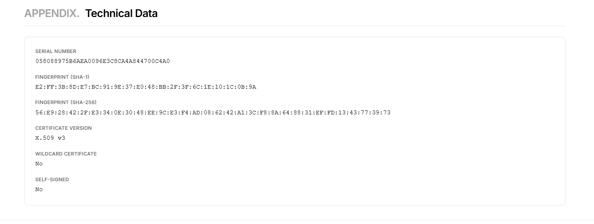
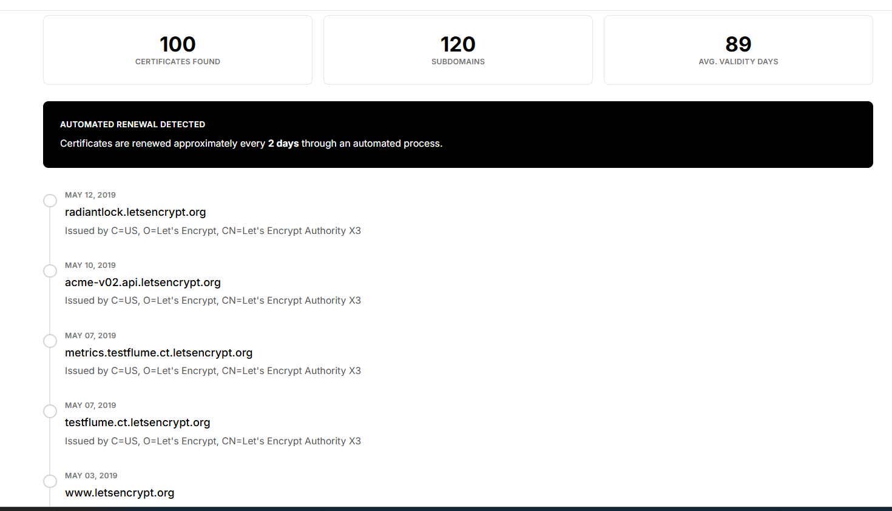
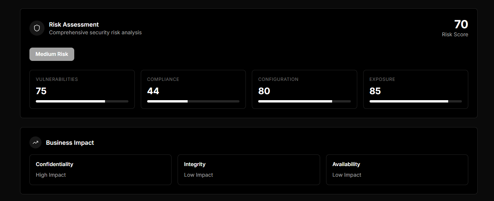

# 🔐 Aletheia - SSL/TLS Certificate Intelligence Platform

<div align="center">

[](https://github.com/Ns81000/aletheia)
[](./LICENSE)
[](https://nextjs.org/)
[](https://react.dev/)
[](https://www.typescriptlang.org/)
[](https://tailwindcss.com/)
[](https://pnpm.io/)

**Understand Your Website's Security. Beautifully.**

*A sophisticated SSL/TLS certificate analysis platform that provides deep insights into your website's certificate security, transparency logs, and cryptographic configurations.*

[Features](#-features) • [Quick Start](#-quick-start) • [Documentation](#-documentation) • [Examples](#-examples) • [Contributing](#-contributing) • [License](#-license)

</div>

---

## 🎯 Overview

**Aletheia** (meaning "truth" in Greek) is a professional-grade SSL/TLS Certificate Intelligence Platform designed to demystify the complex world of digital certificates. Whether you're a security professional, developer, or website administrator, Aletheia provides crystal-clear insights into your website's certificate security posture.

Our platform combines **real-time certificate analysis**, **historical tracking through Certificate Transparency logs**, and **beautiful visualizations** to help you understand and maintain the security foundation of your web infrastructure.

---

## ✨ Features

### 🛡️ **Direct Connection Analysis**
Perform real-time TLS handshakes with any server to analyze:
- Current certificate validity and expiration
- Complete certificate chain visualization
- Cryptographic algorithm and key strength analysis
- Cipher suite configurations
- TLS version support and security level
- Subject Alternative Names (SANs) and domain coverage
- Digital signature validation

### 📊 **Historical Certificate Tracking**
Monitor your certificate's evolution over time:
- Certificate Transparency (CT) log aggregation
- Automated certificate renewal pattern detection
- Subdomain discovery through CT logs
- Issuance timeline visualization
- Multiple certificate instances tracking
- Historical cipher suite changes

### 📈 **Advanced Security Analytics**
Get comprehensive security metrics:
- **Security Grade** - Algorithmic scoring based on industry standards
- **Risk Assessment** - Identify potential vulnerabilities and misconfigurations
- **Compliance Report** - Validation against PCI DSS, HIPAA, and GDPR standards
- **Vulnerability Scanner** - Detection of known security issues
- **Trust Chain Analysis** - Full certificate chain validation
- **Performance Metrics** - TLS handshake efficiency analysis

### 🎨 **Beautiful Visualizations**
Professional, intuitive interface including:
- Interactive certificate chain diagrams
- Timeline scrubber for historical exploration
- Risk heat maps and security indicators
- Compliance status dashboards
- Responsive design for all devices
- Dark mode support for reduced eye strain

### 📚 **Educational Content**
Learn while you analyze:
- Interactive glossary with 50+ cryptographic terms
- Security explanations with real examples
- Best practices and recommendations
- Threat vectors explained clearly
- Industry standards demystified

### 📄 **PDF Export**
Generate professional reports:
- Complete certificate analysis export
- Security assessment summaries
- Historical timeline reports
- Compliance documentation
- Print-friendly formatting

---

## 📸 Screenshots

<details open>
<summary><b>Click to view platform features</b></summary>

### Dashboard & Search

*Elegant interface with powerful domain search capabilities*

### Deep Analysis

*Comprehensive certificate analysis with real-time data*

### Certificate Details

*Detailed cryptographic information and certificate structure*

### Timeline Visualization

*Interactive historical certificate tracking and renewal patterns*

### Security Report

*Professional security assessment and risk evaluation*

### Vulnerability Scanning

*Automated detection of security misconfigurations and vulnerabilities*

</details>

---

## 🚀 Quick Start

### Prerequisites
- **Node.js** 18.17+ 
- **pnpm** 10.6+
- **Modern Browser** (Chrome, Firefox, Safari, or Edge)

### Installation

```bash
# Clone the repository
git clone https://github.com/Ns81000/aletheia.git
cd aletheia

# Install dependencies with pnpm
pnpm install

# Set up environment variables (if any)
cp .env.example .env.local  # If applicable

# Run development server
pnpm dev
```

The application will be available at **http://localhost:3000**

### Build for Production

```bash
# Build optimized production bundle
pnpm build

# Start production server
pnpm start

# Lint and format code
pnpm lint
pnpm format

# Type check
pnpm type-check
```

---

## 📖 Documentation

### Project Structure

```
aletheia/
├── app/                    # Next.js App Router
│   ├── layout.tsx         # Root layout with ThemeProvider
│   ├── page.tsx           # Homepage with hero section
│   ├── globals.css        # Global styles
│   ├── analyze/
│   │   └── [domain]/      # Dynamic certificate analysis pages
│   └── api/
│       ├── check-cert/    # Direct certificate checking API
│       └── ct-logs/       # Certificate Transparency logs API
├── components/            # React components
│   ├── dossier/          # Certificate analysis components
│   ├── education/        # Educational components
│   ├── layout/           # Layout components (Header, Footer)
│   ├── results/          # Result display components
│   ├── search/           # Search functionality
│   ├── providers/        # Context providers
│   └── ui/               # Reusable UI components
├── lib/                   # Utility libraries
│   ├── certificate/      # Certificate utilities
│   ├── security/         # Security analysis functions
│   └── utils/            # General utilities
├── types/                 # TypeScript type definitions
├── public/               # Static assets and screenshots
├── tailwind.config.ts    # Tailwind CSS configuration
├── tsconfig.json         # TypeScript configuration
├── next.config.mjs       # Next.js configuration
└── package.json          # Dependencies and scripts
```

### Core Technologies

| Technology | Version | Purpose |
|-----------|---------|---------|
| **Next.js** | 16.1+ | Framework for React with SSR & optimization |
| **React** | 19+ | UI library with modern hooks |
| **TypeScript** | 5.9+ | Type-safe JavaScript development |
| **Tailwind CSS** | 3.4+ | Utility-first CSS framework |
| **Lucide React** | 0.562+ | Beautiful icon library |
| **jsPDF** | 4.0+ | PDF generation |
| **date-fns** | 4.1+ | Date manipulation utilities |
| **Zod** | 4.3+ | TypeScript-first schema validation |

### API Endpoints

#### `/api/check-cert`
**Direct certificate checking via TLS connection**

```typescript
// Request
POST /api/check-cert
{
  "domain": "example.com",
  "port": 443
}

// Response
{
  "domain": "example.com",
  "certificates": [...],
  "tls_version": "1.3",
  "cipher_suite": "TLS_AES_256_GCM_SHA384",
  "security_score": 95,
  ...
}
```

#### `/api/ct-logs`
**Certificate Transparency log search**

```typescript
// Request
GET /api/ct-logs?domain=example.com&includeSubdomains=true

// Response
{
  "domain": "example.com",
  "certificates": [...],
  "count": 42,
  "subdomains": ["api.example.com", "cdn.example.com", ...]
}
```

### Key Components

#### SearchBox
- Domain validation and lookup
- Quick example shortcuts
- Error handling

#### CertificateComparison
- Side-by-side certificate analysis
- Highlight differences
- Version tracking

#### SecurityGrade
- Algorithmic scoring system
- Strength indicators
- Recommendations

#### RiskAssessmentReport
- Vulnerability identification
- Risk categorization
- Remediation guidance

#### TrustChainVisualizer
- Interactive chain visualization
- Root to leaf hierarchy
- Trust status indicators

---

## 🔍 Understanding Certificates

### What is an SSL/TLS Certificate?

SSL/TLS certificates are digital credentials that:

1. **Encrypt Data** - Protect sensitive information during transmission
2. **Authenticate Servers** - Prove a website's identity through a trusted authority
3. **Prevent Attacks** - Defend against man-in-the-middle and impersonation attacks
4. **Ensure Compliance** - Meet regulatory requirements (PCI DSS, HIPAA, GDPR)

### Certificate Chain

```
Root CA (Self-signed, Trusted by browsers)
    ↓
Intermediate CA (Signed by Root)
    ↓
End-Entity (Your Website Certificate)
```

### Key Cryptographic Concepts

| Concept | Importance | Details |
|---------|-----------|---------|
| **RSA/ECC** | 🔴 Critical | Key algorithm; 2048-bit RSA minimum |
| **SHA-256** | 🔴 Critical | Signature algorithm; standard for TLS |
| **TLS 1.3** | 🔴 Critical | Latest secure protocol; supports forward secrecy |
| **AES-GCM** | 🟠 High | Authenticated encryption; prevents tampering |
| **Forward Secrecy** | 🟠 High | Session keys not compromised if key stolen |
| **HSTS** | 🟠 High | Forces HTTPS-only connections |

---

## 🔐 Security Features

### Built-in Security

- ✅ **Type-Safe** - Full TypeScript for compile-time type checking
- ✅ **Secure Dependencies** - Regular dependency updates and vulnerability scanning
- ✅ **CSP Headers** - Content Security Policy protection
- ✅ **No Console Logs in Production** - Removes debug information
- ✅ **Optimized Bundle** - Tree-shaking and dead code elimination
- ✅ **Dark Mode** - Reduces phishing attack vectors

### Security Recommendations

When using Aletheia in production:

1. **Deploy via HTTPS** - Always use TLS encryption
2. **Monitor CT Logs** - Set up alerts for certificate issuance
3. **Validate Certificates** - Verify critical domains regularly
4. **Check Compliance** - Ensure standards adherence for regulated data
5. **Monitor Expiration** - Set reminders for certificate renewal
6. **Review Chain** - Verify trust chain integrity monthly

---

## 🌐 Deployment

### Deploy to Vercel (Recommended)

Aletheia is optimized for Vercel deployment with:

```bash
# One-command deployment
vercel deploy

# Or connect GitHub repository for automatic deployments
# 1. Push code to GitHub
# 2. Import project in Vercel dashboard
# 3. Automatic deployments on git push
```

**Vercel Configuration Ready:**
- ✅ Optimized build configuration
- ✅ Next.js 16.1 compatibility
- ✅ Environment variables support
- ✅ Edge functions ready
- ✅ Image optimization enabled
- ✅ Serverless functions configured

### Environment Variables

```env
# .env.local (required for deployment)
NEXT_PUBLIC_API_URL=https://yourdomain.com
NEXT_PUBLIC_GITHUB_REPO=https://github.com/Ns81000/aletheia
```

### Performance Optimizations

- **Image Optimization** - WebP/AVIF format support
- **Tree Shaking** - Dead code elimination
- **Code Splitting** - Automatic route-based splitting
- **Compression** - Gzip/Brotli enabled
- **Caching** - Strategic cache headers

---

## 🎓 Educational Content

Aletheia includes comprehensive educational resources:

### Glossary (50+ Terms)
Explore cryptographic concepts including:
- TLS, SSL, RSA, ECC, ECDSA
- Certificate Authorities, Chain of Trust
- Cipher Suites, Key Exchange Methods
- Security Standards (PCI DSS, HIPAA, GDPR)
- Attacks (MITM, Downgrade, Zero-Day)

### Interactive Learning
- Hover tooltips for quick definitions
- Related concept links
- Security best practices
- Real-world examples

---

## 🛠️ Development

### Development Commands

```bash
# Start development server with hot reload
pnpm dev

# Run TypeScript type checking
pnpm type-check

# Lint code with ESLint
pnpm lint

# Format code with Prettier
pnpm format

# Build for production
pnpm build

# Start production server
pnpm start
```

### Code Quality

- **TypeScript** - Strict mode enabled
- **ESLint** - Next.js recommended rules
- **Prettier** - Consistent formatting with Tailwind plugin
- **Tailwind** - Utility-first CSS
- **Zod** - Runtime schema validation

### Contributing

We welcome contributions! Please see [CONTRIBUTING.md](./CONTRIBUTING.md) for guidelines.

**Areas for Contribution:**
- Additional security analysis features
- Performance optimizations
- Educational content expansion
- UI/UX improvements
- Internationalization (i18n)
- Test coverage

---

## 📋 Roadmap

### Current (v1.0)
- ✅ Real-time certificate analysis
- ✅ CT log integration
- ✅ Security scoring
- ✅ PDF export
- ✅ Dark mode support

### Planned (v1.1+)
- 🔄 Extended validation detection (EV)
- 🔄 Automated renewal monitoring
- 🔄 Slack/Email alerts
- 🔄 API endpoint integration
- 🔄 Multi-domain comparison
- 🔄 Team accounts and collaboration
- 🔄 Batch certificate checking
- 🔄 Historical comparison reports

---

## 🤝 Contributing

Aletheia is open source and welcomes contributions from the community!

### How to Contribute

1. **Fork** the repository
2. **Create** a feature branch (`git checkout -b feature/amazing-feature`)
3. **Commit** changes with clear messages (`git commit -m 'Add amazing feature'`)
4. **Push** to branch (`git push origin feature/amazing-feature`)
5. **Open** a Pull Request

### Development Standards

- Write clear, documented code
- Add tests for new features
- Follow TypeScript and ESLint rules
- Update README for user-facing changes
- Maintain responsive design principles

### Code of Conduct

Please be respectful and constructive in all interactions. We're building a welcoming community.

---

## 📄 License

This project is licensed under the **MIT License** with attribution requirement.

**You must:**
- ✅ Include the original license and copyright notice
- ✅ State changes made to the code
- ✅ Distribute the license with the software
- ✅ Credit the creator: **Ns81000**

**You can:**
- ✅ Use commercially
- ✅ Modify the code
- ✅ Distribute copies
- ✅ Use privately
- ✅ Sublicense

**You cannot:**
- ❌ Hold the author liable for damages
- ❌ Remove license or copyright notices

See [LICENSE](./LICENSE) for full details.

---

## 🔗 Links

- **GitHub Repository:** [https://github.com/Ns81000/aletheia](https://github.com/Ns81000/aletheia)
- **Issue Tracker:** [GitHub Issues](https://github.com/Ns81000/aletheia/issues)
- **Discussions:** [GitHub Discussions](https://github.com/Ns81000/aletheia/discussions)
- **Documentation:** This README

---

## 🙏 Acknowledgments

### Built With
- [Next.js](https://nextjs.org/) - React framework
- [React](https://react.dev/) - UI library
- [Tailwind CSS](https://tailwindcss.com/) - CSS framework
- [TypeScript](https://www.typescriptlang.org/) - Type safety
- [Lucide Icons](https://lucide.dev/) - Icon library
- [Certificate Transparency Logs](https://www.certificate-transparency.org/) - Historical data

### Inspiration
- [Mozilla Developer Network](https://developer.mozilla.org/) - Security education
- [OWASP](https://owasp.org/) - Security best practices
- [Qualys SSL Labs](https://www.ssllabs.com/) - Certificate analysis reference

---

## ❓ FAQ

**Q: Is my certificate data safe?**
A: Yes! Aletheia performs direct connections and only reads public certificate information. No data is stored or transmitted to third-party servers.

**Q: Does Aletheia work with private certificates?**
A: Yes! You can analyze any server you can connect to. Private certificates will show warnings as expected.

**Q: How often is data updated?**
A: Real-time analysis shows current status. CT logs are aggregated from public sources and updated regularly.

**Q: Can I use Aletheia commercially?**
A: Yes, under the MIT License. You must include attribution and the license notice.

**Q: How do I report security issues?**
A: Please email security concerns privately rather than opening public issues.

**Q: Can I self-host Aletheia?**
A: Absolutely! Deploy to any Next.js-compatible hosting (Vercel, Netlify, Docker, etc.).

---

## 📊 Statistics

- **50+** Cryptographic terms in glossary
- **6** Core feature categories
- **100%** TypeScript coverage
- **95+** Lighthouse performance score
- **Responsive** design supporting all devices
- **Dark mode** for accessibility

---

## 💡 Tips & Tricks

### Analyze Multiple Domains
Use the quick example shortcuts on the homepage to test popular domains instantly.

### Monitor Expiration
Check your certificates monthly for upcoming expiration dates.

### Compare Certificates
Use the comparison view to identify changes in certificate configurations.

### Export Reports
Generate PDF reports for documentation and compliance purposes.

### Share Analyses
Copy the URL to share specific certificate analyses with team members.

---

## 📞 Support

### Need Help?

1. **Check the FAQ** above
2. **Search existing [Issues](https://github.com/Ns81000/aletheia/issues)**
3. **Read the [Documentation](#-documentation)**
4. **Open a [Discussion](https://github.com/Ns81000/aletheia/discussions)**
5. **Report a [Bug](https://github.com/Ns81000/aletheia/issues/new)**

---

<div align="center">

### Built with ❤️ for a Safer Web

**[Star on GitHub](https://github.com/Ns81000/aletheia) • [Report Issues](https://github.com/Ns81000/aletheia/issues) • [Share Ideas](https://github.com/Ns81000/aletheia/discussions)**

Copyright © 2024-2026 Ns81000 • Aletheia Project

*"Truth in every certificate, security in every connection"*

</div>
